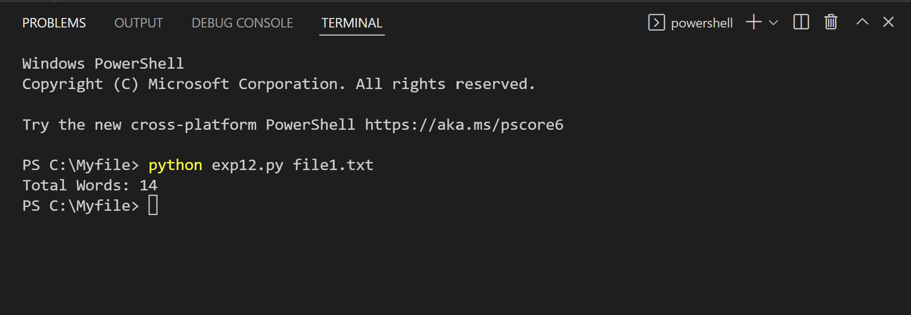

# command-line-arguments-to-count-word
## AIM:
To write a python program for getting the word count from the contents of a file using command line arguments.
## EQUIPEMENT'S REQUIRED: 
PC
Anaconda - Python 3.7
## ALGORITHM: 

Step 1:
Import sys package

Step 2:
Create an empty dictionary

Step 3:
Open the text file in read mode

Step 4:
Split words in each line and store in list

Step 5:
Count the number of occurence of each word in the list

Step 6:
Store the count of each word in dictionary

Step 7:
print the dictionary close the file

## PROGRAM:

Python program for getting the word count from the contents of a file using command line arguments.
Developed by:  Rakesh J.S
Register Number: 22009339

import sys
fp= open(sys.argv[1])
data=fp.read()
words=data.split()
print("Total Words:",len(words))

### OUTPUT:

## RESULT:
Thus the program is written to find the word count from the contents of a file using command line arguments.
